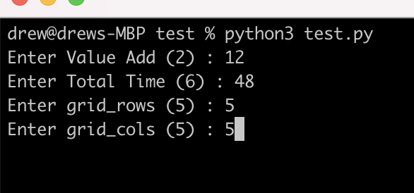
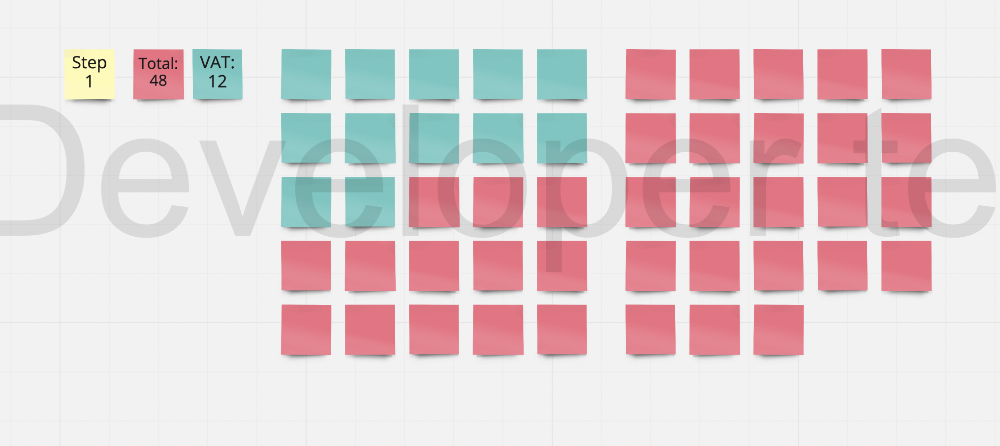

# miro

This is a basic script to demo interacting with a miro board via thier REST API.

The example visulizes a VSM step, showing the Value Add time vs the Total time for a particular step based on user input. The grid size is configurable.

This example could be extended to read multiple steps from a csv, thus being able to visulize an entire VSM via post-its in miro. It would require additional code to loop a csv and drop the y position after each step.

## Getting started

Create token: https://developers.miro.com/docs/getting-started

Create board:

```
  curl --request POST \
    --url 'https://api.miro.com/v1/boards?fields=foo' \
    --header 'Accept: application/json' \
    --header 'Authorization: Bearer XXX' \
    --header 'Content-Type: application/json' \
    --data '
```

## Running the script

Then run `miro.py` after adding bearer and board ids.


`python3 miro.py`:



board:


